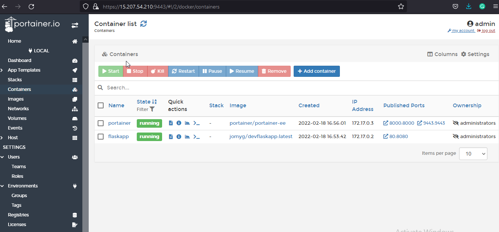

# Portainer-Docker-container-controller

[]()


## Description:

Portainer is a popular Docker UI that helps you visualise your containers, images, volumes and networks. Portainer helps you take control of the Docker resources on your machine, avoiding lengthy terminal commands
Portainer is a lightweight management UI which allows you to easily manage your different Docker environments (Docker hosts or Swarm clusters). Portainer is meant to be as simple to deploy as it is to use. It consists of a single container that can run on any Docker engine (can be deployed as Linux container or a Windows native container, supports other platforms too). Portainer allows you to manage all your Docker resources (containers, images, volumes, networks and more) ! It is compatible with the standalone Docker engine and with Docker Swarm mode.
What do you use Portainer for?
With Portainer, engineers can deploy and see the state of individual containers, restart them and debug them when necessary – all without needing to use the command line. Portainer also provides deep visibility into what's running, where it's running and how it's running, which helps engineers optimize app performance.

## Docker installation

```sh
amazon-linux-extras install docker -y
systemctl start docker.service
systemctl enable docker.service
```

## Portainer Setup : You can follow the offical URl: https://install.portainer.io/setup
```sh
docker run -d -p 8000:8000 -p 9443:9443 --name=portainer --restart=always \
    -v /var/run/docker.sock:/var/run/docker.sock \
    -v portainer_data:/data \
    portainer/portainer-ee
```
```
~]# docker container ls
CONTAINER ID   IMAGE                      COMMAND            CREATED             STATUS             PORTS       NAMES                                                              
7bf79e51a687   portainer/portainer-ee     "/portainer"       About an hour ago   Up About an hour   0.0.0.0:8000->8000/tcp, :::8000->8000/tcp, 0.0.0.0:9443->9443/tcp, :::9443->9443/tcp, 9000/tcp   portainer
```

Now that the installation is complete, you can log into your Portainer Server instance by opening a web browser and going to:
```
https://<serverIP>:9443
```
After calling the URL https://<serverIP>:9443, You need to create a User with password and you need to porvide a license key too. The license key can be created by providing a email address other than gmail. Inorder to create a license key using other than gmail, you can use https://temp-mail.org/en/ for the temp email creation. After providing the license, the Portainer UI is accessable via browser. See below
 
<center> </img></center>
 
 ### Conclusion

Created a Portainer container using the docker bind for control all the docker resources via GUI

#### ⚙️ Connect with Me

<p align="center">
<a href="mailto:jomyambattil@gmail.com"></a>
<a href="https://www.linkedin.com/in/jomygeorge11"></a> 
<a href="https://www.instagram.com/therealjomy"></a><br />
